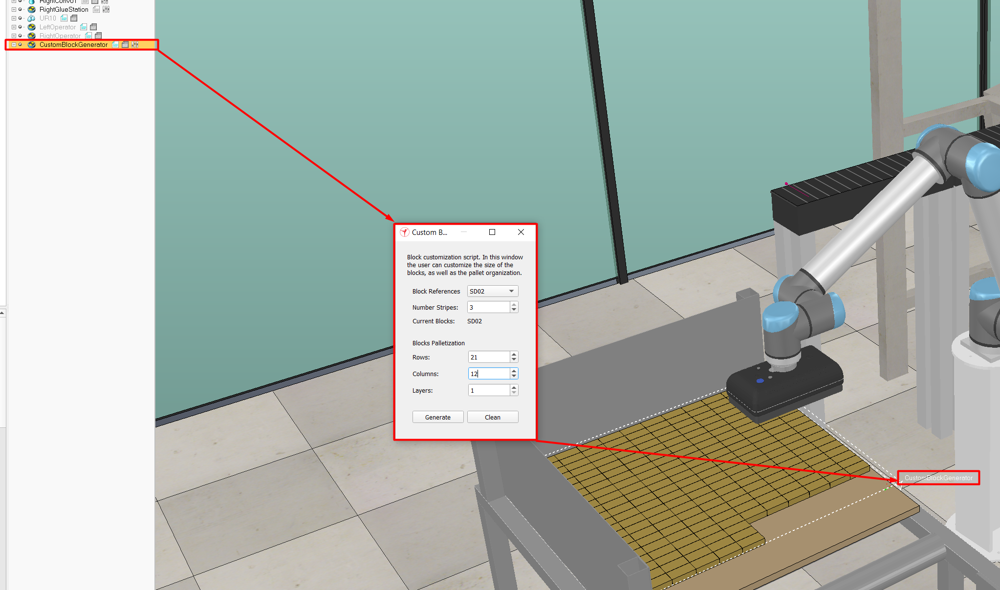

# Executing the simulation

1. Double click the **CustomBlockGenerator** object;
2. From the menu that appears select the reference and the pallet properties (*see example in the figure below*);
3. Hit **Clean** to remove the leftover blocks;
4. Hit **Generate** to renew the pallet;
5. Start the simulation!

